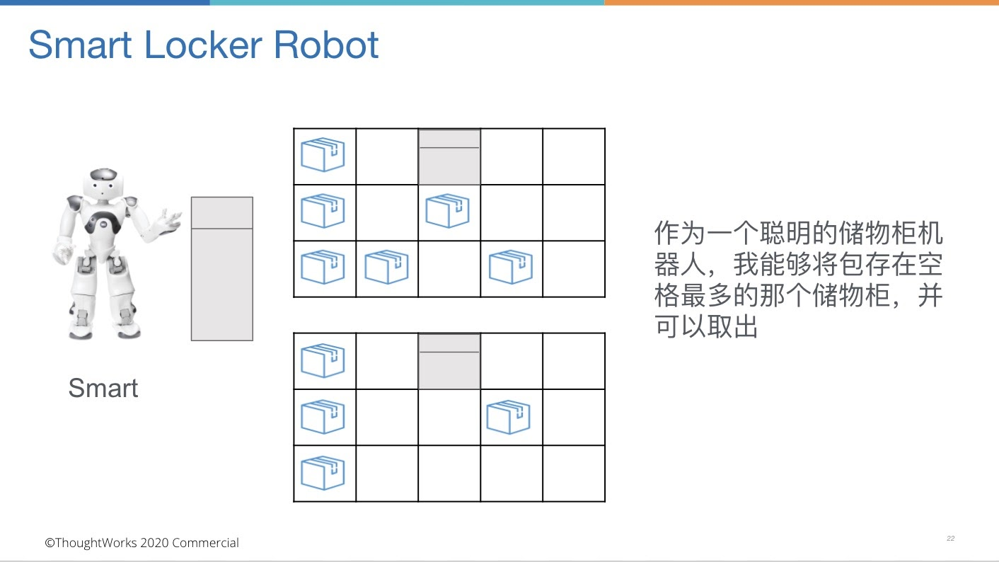

# gz-cz-locker
实现储物柜可以存包，取包
作业要求
- 产出Tasking列表
- 按照TDD的方式实现需求
- 小步提交，commit信息表意
- 最后只需要提交Github地址

happy：

given有空位置，when存包，then存成功，出票，可用箱子数减1

given有效票，when取包，then取成功，可用箱子数加1

unhappy:

given无空位置，when存包，then存失败，提示无空位置

given无效票，when取包，then取包失败，提示无效票

given重复票，when取包，then取包失败，提示无效票

------------------------------------------
实现PrimaryLockerRobot可以存包，取包
作业要求
- 产出Tasking列表
- 按照TDD的方式实现需求
- 小步提交（建议完成一个Task做一次提交，并且所有测试是通过的），commit信息表意
- 最后只需要提交Github地址

Given: 三个储物柜都未满 When：使用Primary Robot存包 then： 包存在储物柜1 得到ticket

Given: 三个储物柜，储物柜1满 储物柜2 有空闲  储物柜3有空闲 When：使用Primary Robot存包 then： 包存在储物柜2 得到ticket

Given: 三个储物柜 一个有效ticket When：使用Primary Robot取包 then： 得到存的包且ticket作废

Given: 三个储物柜 且都存满了 When：使用Primary Robot存包 then： 存包失败，柜箱已满

Given: 三个储物柜 一个非法ticket When：使用Primary Robot取包 then： 票据不合法，取包失败

Given: 三个储物柜 一个合法ticket When：使用Primary Robot取包 ， 再次取包then： 第一次成功，第二次失败



反馈：

1. 在Task的描述中用更精准的业务概念描述，比如：柜子-->储物柜，机器人--> Primary Robot

1. 这里的行为是Primary Robot存包和取包，描述上可以直接使用Primary Robot 存包/取包

3. Case1对顺序存包的场景覆盖少了一个，比如三个都有空间的时候，存到第一个

------------------------------------------

1. 存：
    - Given: 储物柜1有4个空间，储物柜2有3个空间 When：使用smartLockerRobot存包 then： 包存在储物柜1 且得到ticket
    - Given: 储物柜1有3个空间，储物柜2有3个空间 When：使用smartLockerRobot存包 then： 包存在储物柜1 且得到ticket
    - Given: 储物柜1有3个空间，储物柜2有4个空间 When：使用smartLockerRobot存包 then： 包存在储物柜2 且得到ticket
    - Given: 储物柜1和2都已满 When：使用smartLockerRobot存包 then： 存包失败，柜箱已满
2. 取：
    - Given: 三个储物柜 一个有效ticket When：使用 smartLockerRobot 取包 then： 得到存的包且ticket作废

    - Given: 三个储物柜 一个由Primary Robot得到的有效ticket When：使用 smartLockerRobot 取包 then： 得到存的包且ticket作废

    - Given: 三个储物柜 一个由smartLockerRobot得到的有效ticket When：使用 Primary Robot 取包 then： 得到存的包且ticket作废

    - Given: 三个储物柜 一个无效ticket When：使用 smartLockerRobot 取包 then： 票据不合法，取包失败



--------------------------------------------
PR:Primary Robot, SR：smartLockerRobot, RM: Locker Robot Manager
1. 存:
    - 1Given：ABCD四个储物柜分别有1，2，3，4个存储空间，RM管理PR（管理AB储物柜），SR（管理BC储物柜） 以及 D储物柜。When vip用户找RM存包。 Then：包由PR管理的A柜子存储 且得到ticket。 
    - 2Given：ABCD四个储物柜分别有0，2，3，4个存储空间，RM管理PR（管理A储物柜），SR（管理BC储物柜） 以及 D储物柜。When vip用户找RM存包。 Then：包由SR管理的C柜子存储 且得到ticket。 
    - 3Given：ABCD四个储物柜分别有0，0，0，4个存储空间，RM管理PR（管理A储物柜），SR（管理BC储物柜） 以及 D储物柜。When vip用户找RM存包。 Then：包由RM管理的D柜子存储 且得到ticket。 
    - 4Given：ABCD四个储物柜分别有0，0，0，4个存储空间，RM管理PR 以及 D储物柜。When vip用户找RM存包。 Then：包由RM管理的D柜子存储 且得到ticket。 
    - 5Given：有储物柜A具有3个空间，RM管理储物柜A。When vip用户找RM存包。 Then：包存储在A柜子存储 且得到ticket。
    - 6Given：ABCD四个储物柜分别有0，0，0，0个存储空间，RM管理PR（管理A储物柜），SR（管理BC储物柜） 以及 D储物柜。When vip用户找RM存包。 Then：存包失败，柜箱已满。 
    - 7Given：有储物柜A具有0个空间，RM管理储物柜A。When vip用户找RM存包。 Then：存包失败，柜箱已满。

2. 取:
    - 8Given: 有一个由RM交给PR存储包后得到的ticket。 When vip用户使用该ticket找RM取包。 Then：得到存的包且ticket作废。
    - 8Given: 有一个由RM自己存储包后得到的ticket。 When vip用户使用该ticket找RM取包。 Then：得到存的包且ticket作废。
    - 9Given: 有一个由RM存储包后得到的ticket。 When vip用户使用该ticket找PR取包。 Then：票据不合法，取包失败。
    - 10Given: 有一个由RM存储包后得到的ticket。 When vip用户使用该ticket找SR取包。 Then：票据不合法，取包失败。
    - 10Given: 有一个由PR存储包后得到的ticket。 When vip用户使用该ticket找SR取包。 Then：票据不合法，取包失败。
    - 11Given: 有一个非法ticket。 When vip用户使用该ticket找RM取包。 Then：票据不合法，取包失败。

